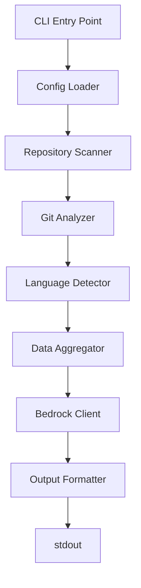
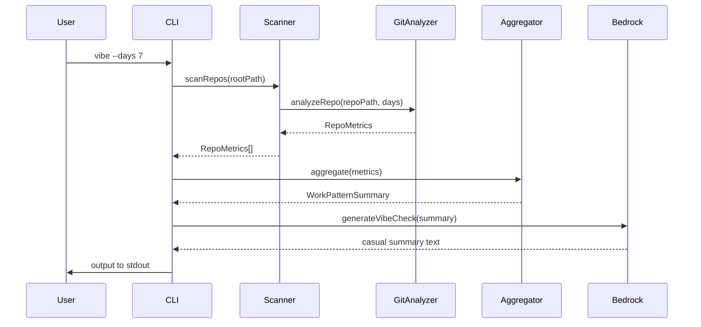

# Design Document: vibe-cli

## Overview

The `vibe` CLI tool provides developers with a casual, AI-generated summary of their recent coding activity across all git repositories. It scans a configurable directory tree for git repos, collects commit metrics (last commit date, recent commit count, detected languages), aggregates this data into a work pattern analysis, and uses Claude via AWS Bedrock to generate a friendly 3-4 sentence journal-style summary. The tool is designed as a globally installable npm package that runs as a single command with minimal configuration.

## Architecture



## Sequence Diagrams

### Main Execution Flow




## Components and Interfaces

### Component 1: CLI Entry Point

**Purpose**: Parse command-line arguments, orchestrate the workflow, handle errors

**Interface**:
```typescript
interface CLIOptions {
  days: number;
  root?: string;
  raw?: boolean;
}

interface CLIRunner {
  run(args: string[]): Promise<void>;
}
```

**Responsibilities**:
- Parse CLI arguments using a lightweight parser
- Load configuration from environment or defaults
- Orchestrate the scanning, analysis, and output pipeline
- Handle errors gracefully with user-friendly messages

### Component 2: Repository Scanner

**Purpose**: Recursively find all git repositories under the root directory

**Interface**:
```typescript
interface RepositoryScanner {
  scanRepos(rootPath: string): Promise<string[]>;
}

interface ScanOptions {
  maxDepth?: number;
  ignorePatterns?: string[];
}
```

**Responsibilities**:
- Traverse directory tree starting from root
- Identify directories containing `.git` folder
- Skip nested repos (don't scan inside found repos)
- Return list of repository paths

### Component 3: Git Analyzer

**Purpose**: Extract commit metrics from a git repository

**Interface**:
```typescript
interface GitAnalyzer {
  analyzeRepo(repoPath: string, days: number): Promise<RepoMetrics>;
}

interface RepoMetrics {
  repoPath: string;
  repoName: string;
  lastCommitDate: Date | null;
  commitCountInPeriod: number;
  languages: LanguageStats[];
  isActive: boolean;
}

interface LanguageStats {
  language: string;
  percentage: number;
}
```

**Responsibilities**:
- Execute git commands to get commit history
- Parse git log output for date and count
- Determine if repo is active based on recent commits
- Handle repos with no commits gracefully


### Component 4: Language Detector

**Purpose**: Detect programming languages used in a repository

**Interface**:
```typescript
interface LanguageDetector {
  detectLanguages(repoPath: string): Promise<LanguageStats[]>;
}
```

**Responsibilities**:
- Analyze file extensions in the repository
- Calculate percentage distribution of languages
- Return sorted list by percentage (descending)
- Use simple heuristics (file extensions) to avoid heavy dependencies

### Component 5: Data Aggregator

**Purpose**: Aggregate repository metrics into work pattern insights

**Interface**:
```typescript
interface DataAggregator {
  aggregate(metrics: RepoMetrics[]): WorkPatternSummary;
}

interface WorkPatternSummary {
  totalRepos: number;
  activeRepos: number;
  coldRepos: number;
  totalCommits: number;
  commitDistribution: 'focused' | 'clustered' | 'spread' | 'sparse';
  topLanguages: LanguageStats[];
  mostActiveRepos: string[];
  timeRange: { start: Date; end: Date };
}
```

**Responsibilities**:
- Count active vs cold repositories
- Sum total commits across all repos
- Determine commit distribution pattern
- Identify top languages across all repos
- Rank most active repositories

### Component 6: Bedrock Client

**Purpose**: Generate casual summary using Claude via AWS Bedrock

**Interface**:
```typescript
interface BedrockClient {
  generateVibeCheck(summary: WorkPatternSummary): Promise<string>;
}

interface BedrockConfig {
  region: string;
  modelId: string;
  maxTokens: number;
}
```

**Responsibilities**:
- Format work pattern summary into prompt with natural language distribution descriptions
- Call AWS Bedrock with appropriate parameters
- Handle Bedrock API errors and model availability issues
- Return generated text
- Use AWS SDK credential chain for authentication


### Component 7: Configuration Manager

**Purpose**: Load and manage configuration from environment and defaults

**Interface**:
```typescript
interface ConfigManager {
  loadConfig(requireAwsConfig?: boolean): Config;
}

interface Config {
  rootPath: string;
  awsRegion: string;
  modelId: string;
  defaultDays: number;
  maxDepth: number;
}
```

**Responsibilities**:
- Check AWS credentials via AWS SDK credential chain
- Read environment variables (VIBE_ROOT, AWS_REGION, BEDROCK_MODEL_ID)
- Provide sensible defaults (us-east-1 region, cross-region inference profile)
- Validate required configuration
- Expand tilde (~) in paths
- Skip AWS validation when --raw flag is used

## Data Models

### Model 1: RepoMetrics

```typescript
interface RepoMetrics {
  repoPath: string;
  repoName: string;
  lastCommitDate: Date | null;
  commitCountInPeriod: number;
  languages: LanguageStats[];
  isActive: boolean;
}
```

**Validation Rules**:
- `repoPath` must be absolute path
- `repoName` derived from last path segment
- `lastCommitDate` null if no commits exist
- `commitCountInPeriod` must be non-negative
- `isActive` true if commitCountInPeriod > 0

### Model 2: WorkPatternSummary

```typescript
interface WorkPatternSummary {
  totalRepos: number;
  activeRepos: number;
  coldRepos: number;
  totalCommits: number;
  commitDistribution: 'focused' | 'clustered' | 'spread' | 'sparse';
  topLanguages: LanguageStats[];
  mostActiveRepos: string[];
  timeRange: { start: Date; end: Date };
}
```

**Validation Rules**:
- `totalRepos = activeRepos + coldRepos`
- `totalCommits` sum of all repo commit counts
- `commitDistribution` determined by number of active repos and variance:
  - `focused`: exactly one active repository
  - `clustered`: multiple active repos with high variance (stdDev > mean * 0.5)
  - `spread`: multiple active repos with low variance (stdDev ≤ mean * 0.5)
  - `sparse`: no active repositories
- `topLanguages` limited to top 5
- `mostActiveRepos` limited to top 3


### Model 3: LanguageStats

```typescript
interface LanguageStats {
  language: string;
  percentage: number;
}
```

**Validation Rules**:
- `language` must be non-empty string
- `percentage` must be between 0 and 100
- Sum of percentages across all languages should equal 100

## Algorithmic Pseudocode

### Main Processing Algorithm

```typescript
async function main(args: string[]): Promise<void>
```

**Preconditions:**
- `args` is valid array of command-line arguments
- Node.js environment is available
- File system is accessible

**Postconditions:**
- Outputs casual summary to stdout
- Exits with code 0 on success, non-zero on error
- No side effects on file system

**Algorithm:**
```typescript
async function main(args: string[]): Promise<void> {
  // ASSERT: args is defined and is array
  
  // Step 1: Parse CLI options
  const options = parseCLIArgs(args);
  // ASSERT: options.days > 0
  
  // Step 2: Load configuration
  const config = loadConfig();
  const rootPath = options.root ?? config.rootPath;
  // ASSERT: rootPath is valid directory path
  
  // Step 3: Scan for repositories
  const repoPaths = await scanRepos(rootPath);
  // ASSERT: repoPaths is array of valid paths
  
  // Step 4: Analyze each repository
  const metrics: RepoMetrics[] = [];
  for (const repoPath of repoPaths) {
    // LOOP INVARIANT: All processed repos have valid metrics
    const repoMetrics = await analyzeRepo(repoPath, options.days);
    metrics.push(repoMetrics);
  }
  // ASSERT: metrics.length === repoPaths.length
  
  // Step 5: Aggregate data
  const summary = aggregate(metrics);
  // ASSERT: summary.totalRepos === metrics.length
  
  // Step 6: Generate vibe check
  const vibeText = await generateVibeCheck(summary, config.claudeApiKey);
  // ASSERT: vibeText is non-empty string
  
  // Step 7: Output to stdout
  console.log(vibeText);
}
```


### Repository Scanning Algorithm

```typescript
async function scanRepos(rootPath: string): Promise<string[]>
```

**Preconditions:**
- `rootPath` exists and is a directory
- Process has read permissions on rootPath

**Postconditions:**
- Returns array of absolute paths to git repositories
- Each path contains a `.git` directory
- No nested repositories included

**Algorithm:**
```typescript
async function scanRepos(rootPath: string): Promise<string[]> {
  const repos: string[] = [];
  const queue: string[] = [rootPath];
  
  while (queue.length > 0) {
    // LOOP INVARIANT: All paths in repos are valid git repositories
    const currentPath = queue.shift()!;
    
    // Check if current directory is a git repo
    const gitPath = path.join(currentPath, '.git');
    if (await exists(gitPath)) {
      repos.push(currentPath);
      continue; // Don't scan inside git repos
    }
    
    // Add subdirectories to queue
    const entries = await readdir(currentPath, { withFileTypes: true });
    for (const entry of entries) {
      if (entry.isDirectory() && !entry.name.startsWith('.')) {
        queue.push(path.join(currentPath, entry.name));
      }
    }
  }
  
  // ASSERT: All repos contain .git directory
  return repos;
}
```

### Git Analysis Algorithm

```typescript
async function analyzeRepo(repoPath: string, days: number): Promise<RepoMetrics>
```

**Preconditions:**
- `repoPath` is valid git repository
- `days` is positive integer
- Git executable is available in PATH

**Postconditions:**
- Returns valid RepoMetrics object
- `commitCountInPeriod` accurately reflects commits in time range
- `isActive` correctly set based on commit count

**Algorithm:**
```typescript
async function analyzeRepo(repoPath: string, days: number): Promise<RepoMetrics> {
  const repoName = path.basename(repoPath);
  const sinceDate = new Date(Date.now() - days * 24 * 60 * 60 * 1000);
  
  // Get last commit date
  const lastCommitCmd = 'git log -1 --format=%cI';
  const lastCommitOutput = await execGit(repoPath, lastCommitCmd);
  const lastCommitDate = lastCommitOutput ? new Date(lastCommitOutput.trim()) : null;
  
  // Get commit count in period
  const commitCountCmd = `git log --since="${sinceDate.toISOString()}" --oneline`;
  const commitOutput = await execGit(repoPath, commitCountCmd);
  const commitCountInPeriod = commitOutput ? commitOutput.trim().split('\n').length : 0;
  
  // Detect languages
  const languages = await detectLanguages(repoPath);
  
  // Determine if active
  const isActive = commitCountInPeriod > 0;
  
  return {
    repoPath,
    repoName,
    lastCommitDate,
    commitCountInPeriod,
    languages,
    isActive
  };
}
```


### Language Detection Algorithm

```typescript
async function detectLanguages(repoPath: string): Promise<LanguageStats[]>
```

**Preconditions:**
- `repoPath` is valid directory path
- Process has read permissions

**Postconditions:**
- Returns sorted array of language statistics
- Sum of percentages equals 100 (or 0 if no files)
- Languages sorted by percentage descending

**Algorithm:**
```typescript
async function detectLanguages(repoPath: string): Promise<LanguageStats[]> {
  const extensionMap: Record<string, string> = {
    '.ts': 'TypeScript',
    '.js': 'JavaScript',
    '.py': 'Python',
    '.java': 'Java',
    '.go': 'Go',
    '.rs': 'Rust',
    '.rb': 'Ruby',
    '.php': 'PHP',
    '.c': 'C',
    '.cpp': 'C++',
    '.cs': 'C#',
    '.swift': 'Swift',
    '.kt': 'Kotlin',
    // Add more as needed
  };
  
  const languageCounts: Record<string, number> = {};
  let totalFiles = 0;
  
  // Recursively count files by extension
  async function walkDir(dir: string) {
    const entries = await readdir(dir, { withFileTypes: true });
    
    for (const entry of entries) {
      // LOOP INVARIANT: languageCounts accurately reflects processed files
      const fullPath = path.join(dir, entry.name);
      
      if (entry.isDirectory()) {
        if (!entry.name.startsWith('.') && entry.name !== 'node_modules') {
          await walkDir(fullPath);
        }
      } else if (entry.isFile()) {
        const ext = path.extname(entry.name);
        const language = extensionMap[ext];
        if (language) {
          languageCounts[language] = (languageCounts[language] || 0) + 1;
          totalFiles++;
        }
      }
    }
  }
  
  await walkDir(repoPath);
  
  // Convert to percentages
  const languages: LanguageStats[] = Object.entries(languageCounts)
    .map(([language, count]) => ({
      language,
      percentage: Math.round((count / totalFiles) * 100)
    }))
    .sort((a, b) => b.percentage - a.percentage);
  
  return languages;
}
```


### Data Aggregation Algorithm

```typescript
function aggregate(metrics: RepoMetrics[]): WorkPatternSummary
```

**Preconditions:**
- `metrics` is array of valid RepoMetrics objects
- Each metric has non-negative commitCountInPeriod

**Postconditions:**
- Returns valid WorkPatternSummary
- `totalRepos` equals `metrics.length`
- `activeRepos + coldRepos` equals `totalRepos`
- `commitDistribution` accurately reflects pattern

**Algorithm:**
```typescript
function aggregate(metrics: RepoMetrics[]): WorkPatternSummary {
  const totalRepos = metrics.length;
  const activeRepos = metrics.filter(m => m.isActive).length;
  const coldRepos = totalRepos - activeRepos;
  const totalCommits = metrics.reduce((sum, m) => sum + m.commitCountInPeriod, 0);
  
  // Determine commit distribution
  const commitCounts = metrics.map(m => m.commitCountInPeriod);
  const distribution = determineDistribution(commitCounts);
  
  // Aggregate languages across all repos
  const languageMap: Record<string, number> = {};
  let totalLanguageFiles = 0;
  
  for (const metric of metrics) {
    for (const lang of metric.languages) {
      const fileCount = Math.round(lang.percentage); // Approximate
      languageMap[lang.language] = (languageMap[lang.language] || 0) + fileCount;
      totalLanguageFiles += fileCount;
    }
  }
  
  const topLanguages: LanguageStats[] = Object.entries(languageMap)
    .map(([language, count]) => ({
      language,
      percentage: Math.round((count / totalLanguageFiles) * 100)
    }))
    .sort((a, b) => b.percentage - a.percentage)
    .slice(0, 5);
  
  // Find most active repos
  const mostActiveRepos = metrics
    .filter(m => m.isActive)
    .sort((a, b) => b.commitCountInPeriod - a.commitCountInPeriod)
    .slice(0, 3)
    .map(m => m.repoName);
  
  const now = new Date();
  const timeRange = {
    start: new Date(now.getTime() - 7 * 24 * 60 * 60 * 1000),
    end: now
  };
  
  return {
    totalRepos,
    activeRepos,
    coldRepos,
    totalCommits,
    commitDistribution: distribution,
    topLanguages,
    mostActiveRepos,
    timeRange
  };
}

function determineDistribution(commitCounts: number[]): 'clustered' | 'spread' | 'sparse' {
  const activeRepos = commitCounts.filter(c => c > 0);
  
  if (activeRepos.length === 0) return 'sparse';
  if (activeRepos.length === 1) return 'clustered';
  
  // Calculate variance
  const mean = activeRepos.reduce((a, b) => a + b, 0) / activeRepos.length;
  const variance = activeRepos.reduce((sum, c) => sum + Math.pow(c - mean, 2), 0) / activeRepos.length;
  const stdDev = Math.sqrt(variance);
  
  // High variance = clustered (commits concentrated in few repos)
  // Low variance = spread (commits distributed evenly)
  if (stdDev > mean * 0.5) return 'clustered';
  return 'spread';
}
```


### Bedrock API Integration Algorithm

```typescript
async function generateVibeCheck(summary: WorkPatternSummary, region: string, modelId: string): Promise<string>
```

**Preconditions:**
- `summary` is valid WorkPatternSummary object
- `region` is valid AWS region string
- `modelId` is valid Bedrock model ID (cross-region inference profile)
- AWS credentials are configured
- Network connectivity available

**Postconditions:**
- Returns 3-4 sentence casual summary
- Text is journal-style, not report-style
- Handles Bedrock API errors gracefully

**Algorithm:**
```typescript
async function generateVibeCheck(summary: WorkPatternSummary, region: string, modelId: string): Promise<string> {
  const client = new BedrockRuntimeClient({ region });
  const prompt = buildPrompt(summary);
  
  const payload = {
    anthropic_version: 'bedrock-2023-05-31',
    max_tokens: 200,
    messages: [{
      role: 'user',
      content: prompt
    }]
  };
  
  const command = new InvokeModelCommand({
    modelId,
    contentType: 'application/json',
    accept: 'application/json',
    body: JSON.stringify(payload)
  });
  
  try {
    const response = await client.send(command);
    const responseBody = JSON.parse(new TextDecoder().decode(response.body));
    
    if (responseBody.content && responseBody.content.length > 0) {
      return responseBody.content[0].text;
    }
    
    throw new Error('No content in Bedrock response');
  } catch (error) {
    throw new Error(`Error calling Bedrock API: ${error.message}`);
  }
}

function buildPrompt(summary: WorkPatternSummary): string {
  // Convert distribution to natural language
  let distributionDesc = '';
  switch (summary.commitDistribution) {
    case 'focused':
      distributionDesc = 'focused on a single repository';
      break;
    case 'clustered':
      distributionDesc = 'concentrated in a few repositories';
      break;
    case 'spread':
      distributionDesc = 'spread evenly across repositories';
      break;
    case 'sparse':
      distributionDesc = 'sparse with minimal activity';
      break;
  }
  
  return `You're reviewing a developer's week of coding activity. Here's what happened:

- Total repositories: ${summary.totalRepos}
- Active repos (with commits): ${summary.activeRepos}
- Cold repos (no commits): ${summary.coldRepos}
- Total commits: ${summary.totalCommits}
- Commit pattern: ${distributionDesc}
- Top languages: ${summary.topLanguages.map(l => l.language).join(', ')}
- Most active repos: ${summary.mostActiveRepos.join(', ')}

Write a casual, friendly 3-4 sentence summary of how this week of work is looking. Make it feel like a journal entry, not a report. Be conversational and observant about the patterns you see.`;
}
```

## Key Functions with Formal Specifications

### Function 1: parseCLIArgs()

```typescript
function parseCLIArgs(args: string[]): CLIOptions
```

**Preconditions:**
- `args` is array of strings from process.argv

**Postconditions:**
- Returns CLIOptions with validated values
- `days` is positive integer, defaults to 7
- `root` is optional string path

**Loop Invariants:** N/A


### Function 2: execGit()

```typescript
async function execGit(repoPath: string, command: string): Promise<string>
```

**Preconditions:**
- `repoPath` is valid git repository
- `command` is valid git command string
- Git executable exists in PATH

**Postconditions:**
- Returns stdout from git command
- Returns empty string if command fails
- No modifications to repository

**Loop Invariants:** N/A

### Function 3: loadConfig()

```typescript
function loadConfig(requireAwsConfig?: boolean): Config
```

**Preconditions:**
- Process environment is accessible

**Postconditions:**
- Returns valid Config object
- `rootPath` defaults to ~/code if not set
- `awsRegion` defaults to us-east-1 if not set
- `modelId` defaults to us.anthropic.claude-3-5-haiku-20241022-v1:0 if not set
- Checks AWS credentials via SDK credential chain if requireAwsConfig is true
- Throws error if AWS credentials not found and requireAwsConfig is true

**Loop Invariants:** N/A

## Example Usage

```typescript
// Example 1: Basic usage with defaults
// Command: vibe
// Scans ~/code, analyzes last 7 days, calls Bedrock, outputs AI summary to stdout

// Example 2: Custom time range
// Command: vibe --days 14
// Scans ~/code, analyzes last 14 days

// Example 3: Custom root path
// Command: vibe --root ~/projects
// Scans ~/projects instead of ~/code

// Example 4: Raw output mode
// Command: vibe --raw
// Scans ~/code, outputs metrics in key=value format without calling Bedrock

// Example 5: Combined options
// Command: vibe --days 30 --root ~/work
// Scans ~/work, analyzes last 30 days

// Example AI output:
// "This week looks like a laser-focused sprint in TypeScript land, with all energy 
// channeled into the vibe project. Just one commit tells a story of careful, deliberate 
// work—maybe fine-tuning something important or laying groundwork for a bigger feature."

// Example raw output:
// time_range_start=2026-02-14T12:00:00.000Z
// time_range_end=2026-02-21T12:00:00.000Z
// total_repos=1
// active_repos=1
// cold_repos=0
// total_commits=1
// commit_distribution=focused
// top_language_1=TypeScript:100%
// most_active_repo_1=vibe
```


## Correctness Properties

*A property is a characteristic or behavior that should hold true across all valid executions of a system—essentially, a formal statement about what the system should do. Properties serve as the bridge between human-readable specifications and machine-verifiable correctness guarantees.*

### Property 1: Repository Scanning Completeness

*For any* directory tree starting from a root path, all directories containing a .git subdirectory should be discovered by the scanner, and no nested repositories (repositories inside other repositories) should be included in the results.

**Validates: Requirements 3.1, 3.2, 3.7**

### Property 2: Hidden Directory Exclusion

*For any* directory tree containing hidden directories (starting with .) or common non-code directories (like node_modules), the scanner should skip these directories and not include them in repository discovery.

**Validates: Requirements 3.3, 3.4**

### Property 3: Commit Count Accuracy

*For any* git repository and time period, the commit count returned by the analyzer should match the actual number of commits made within that time period.

**Validates: Requirements 4.4**

### Property 4: Repository Classification Correctness

*For any* repository, it should be classified as active if and only if it has at least one commit in the specified time period, and classified as cold otherwise.

**Validates: Requirements 4.5, 4.6**

### Property 5: Non-Negative Commit Counts

*For any* repository analysis, the commit count should always be a non-negative integer (>= 0).

**Validates: Requirements 4.8**

### Property 6: Language Percentage Validity

*For any* repository, the sum of language percentages should not exceed 100, and languages should be sorted by percentage in descending order.

**Validates: Requirements 5.2, 5.3, 5.6**

### Property 7: Language Detection Directory Exclusion

*For any* repository containing hidden directories or node_modules, the language detector should skip these directories when analyzing file extensions.

**Validates: Requirements 5.4**

### Property 8: Aggregation Consistency

*For any* list of repository metrics, the aggregated totals should be mathematically consistent: totalRepos should equal the length of the metrics list, and activeRepos plus coldRepos should equal totalRepos.

**Validates: Requirements 6.1, 6.2, 6.7**

### Property 9: Total Commits Accuracy

*For any* list of repository metrics, the total commits in the aggregated summary should equal the sum of commit counts across all individual repositories.

**Validates: Requirements 6.3**

### Property 10: Distribution Classification Validity

*For any* list of repository metrics, the commit distribution pattern should be classified as exactly one of: focused, clustered, spread, or sparse.

**Validates: Requirements 6.4, 6.5, 6.6, 6.7, 6.8**

### Property 11: Top Languages Limit

*For any* aggregated language statistics, the top languages list should contain at most 5 languages, sorted by percentage in descending order.

**Validates: Requirements 6.5**

### Property 12: Top Repositories Limit

*For any* aggregated repository metrics, the most active repositories list should contain at most 3 repositories, sorted by commit count in descending order.

**Validates: Requirements 6.6**

### Property 13: Time Range Calculation

*For any* number of days specified, the time range in the work pattern summary should span exactly that many days from the current time.

**Validates: Requirements 1.2**

### Property 14: Tilde Expansion

*For any* path configuration containing a tilde (~), the config manager should expand it to the user's home directory.

**Validates: Requirements 2.4**

### Property 15: API Key Security

*For any* execution of the tool, the API key should never appear in any output, logs, or error messages.

**Validates: Requirements 7.6**

### Property 16: HTTPS API Communication

*For any* API call to Claude, the communication should use HTTPS protocol.

**Validates: Requirements 7.7**

### Property 17: Successful Execution Output

*For any* successful execution, the generated summary should be output to stdout and the process should exit with code 0.

**Validates: Requirements 1.5, 8.1**

### Property 18: Error Output Routing

*For any* error condition, error messages should be output to stderr, not stdout.

**Validates: Requirements 8.3**

### Property 19: Path Validation

*For any* path provided to git commands, the path should be validated and sanitized before execution to prevent injection attacks.

**Validates: Requirements 11.3**

### Property 20: Symlink Safety

*For any* directory tree containing symlinks, the scanner should not follow symlinks that lead outside the intended directory tree.

**Validates: Requirements 11.5**

### Property 21: API Response Validation

*For any* response from the Claude API, the response should be validated before processing to ensure it contains the expected structure.

**Validates: Requirements 11.6**


## Error Handling

### Error Scenario 1: Missing API Key

**Condition**: ANTHROPIC_API_KEY environment variable not set
**Response**: Display clear error message: "Error: ANTHROPIC_API_KEY environment variable not set. Please set it to use vibe."
**Recovery**: Exit with code 1

### Error Scenario 2: Invalid Root Path

**Condition**: Specified root path does not exist or is not a directory
**Response**: Display error: "Error: Root path '{path}' does not exist or is not a directory."
**Recovery**: Exit with code 1

### Error Scenario 3: Git Command Failure

**Condition**: Git command fails in a repository (e.g., corrupted repo)
**Response**: Log warning, skip that repository, continue with others
**Recovery**: Continue processing remaining repositories

### Error Scenario 4: Claude API Failure

**Condition**: API request fails (network error, rate limit, invalid key)
**Response**: Display error with details: "Error calling Claude API: {error message}"
**Recovery**: Exit with code 1

### Error Scenario 5: No Repositories Found

**Condition**: Scanner finds zero git repositories
**Response**: Display message: "No git repositories found in {rootPath}. Nothing to analyze."
**Recovery**: Exit with code 0 (not an error, just nothing to do)

### Error Scenario 6: Permission Denied

**Condition**: Process lacks permission to read directories
**Response**: Log warning for specific directory, continue scanning accessible areas
**Recovery**: Continue with accessible repositories

## Testing Strategy

### Unit Testing Approach

Test each component in isolation with mocked dependencies:

- **Repository Scanner**: Test with mock filesystem containing various directory structures
- **Git Analyzer**: Test with mock git command outputs for various scenarios (no commits, many commits, etc.)
- **Language Detector**: Test with mock file trees containing different language distributions
- **Data Aggregator**: Test with various metric combinations to verify aggregation logic
- **Claude Client**: Test with mock API responses

Key test cases:
- Empty repository list
- Single repository with no commits
- Multiple repositories with varying activity levels
- Edge cases: very old repos, repos with thousands of commits
- Language detection with mixed file types


### Property-Based Testing Approach

Use property-based testing to verify invariants across random inputs:

**Property Test Library**: fast-check (TypeScript)

**Properties to Test**:

1. **Scanning Idempotence**: Running scanRepos twice on same path returns same results
2. **Aggregation Totals**: For any list of metrics, activeRepos + coldRepos = totalRepos
3. **Language Percentages**: Sum of language percentages never exceeds 100
4. **Commit Count Non-Negative**: All commit counts are >= 0
5. **Time Range Validity**: Time range end is always after start
6. **Distribution Classification**: Distribution type is always one of the three valid values

Example property test:
```typescript
import fc from 'fast-check';

test('aggregation totals are consistent', () => {
  fc.assert(
    fc.property(
      fc.array(repoMetricsArbitrary()),
      (metrics) => {
        const summary = aggregate(metrics);
        return summary.activeRepos + summary.coldRepos === summary.totalRepos;
      }
    )
  );
});
```

### Integration Testing Approach

Test the complete workflow with a controlled test environment:

- Create temporary directory structure with test git repositories
- Initialize test repos with known commit history
- Run vibe CLI against test directory
- Verify output contains expected patterns
- Mock Claude API to avoid external dependencies in tests

Test scenarios:
- End-to-end flow with 3 repos (1 active, 2 cold)
- Handling of repos with no commits
- Custom --days flag
- Custom --root flag

## Performance Considerations

### Scanning Performance

- Use breadth-first search to find repositories efficiently
- Skip hidden directories (starting with .) except .git
- Skip common large directories (node_modules, .venv, target, etc.)
- Consider parallel scanning for large directory trees (future optimization)

### Git Command Performance

- Use minimal git log format to reduce parsing overhead
- Limit git log output to necessary information only
- Consider caching results for very large repositories (future optimization)

### Language Detection Performance

- Use simple file extension matching instead of content analysis
- Skip binary files and common non-code directories
- Limit directory traversal depth if needed
- Consider sampling for very large repositories (future optimization)

### API Performance

- Single API call per vibe execution
- Keep prompt concise to minimize token usage
- Use haiku model for fast, cost-effective responses

**Expected Performance**: Should complete in under 10 seconds for typical developer setup (~20-30 repos)


## Security Considerations

### AWS Credentials Security

- Use AWS SDK credential chain (environment variables, profiles, IAM roles)
- Never hardcode AWS credentials
- Never log or display AWS credentials in output or error messages
- Recommend using AWS profiles or IAM roles for key management
- Document secure credential configuration in AWS_BEDROCK_SETUP.md

### Command Injection Prevention

- Use child_process.execFile instead of exec to prevent shell injection
- Validate and sanitize all paths before passing to git commands
- Never construct git commands from user input without validation

### File System Access

- Respect file system permissions
- Handle permission errors gracefully
- Don't follow symlinks that could lead outside intended directory tree
- Validate that root path is within user's home directory or explicitly allowed locations

### Network Security

- Use AWS SDK for secure communication with Bedrock
- Validate Bedrock API responses before processing
- Handle network errors without exposing sensitive information
- AWS SDK handles TLS/SSL automatically

## Dependencies

### Core Dependencies

- **@anthropic-ai/sdk** (^0.27.0): Official Claude API client
- **commander** (^12.0.0): CLI argument parsing
- **chalk** (^5.3.0): Terminal output formatting (optional, for colored output)

### Development Dependencies

- **typescript** (^5.3.0): TypeScript compiler
- **@types/node** (^22.0.0): Node.js type definitions
- **vitest** (^1.0.0): Testing framework
- **fast-check** (^3.15.0): Property-based testing
- **tsx** (^4.7.0): TypeScript execution for development

### Runtime Requirements

- **Node.js**: Version 22 or higher (ESM support)
- **Git**: Must be installed and available in PATH
- **ANTHROPIC_API_KEY**: Environment variable with valid API key

### Package Configuration

```json
{
  "name": "vibe-cli",
  "version": "1.0.0",
  "type": "module",
  "bin": {
    "vibe": "./dist/index.js"
  },
  "engines": {
    "node": ">=22.0.0"
  }
}
```

### Installation

```bash
npm install -g vibe-cli
```

### Configuration

Set environment variable:
```bash
export ANTHROPIC_API_KEY="your-api-key-here"
export VIBE_ROOT="~/code"  # Optional, defaults to ~/code
```
